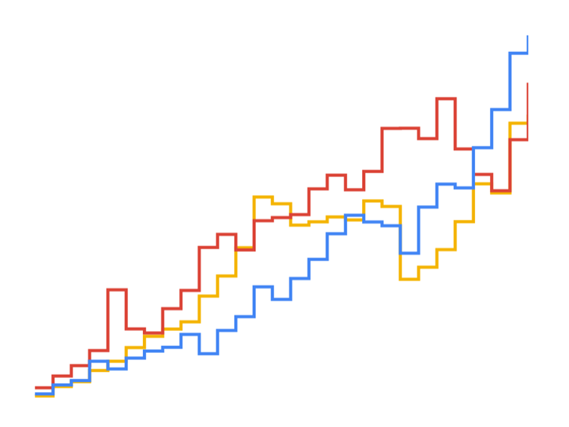

# Data Studio Chart.js Line Chart community visualization

Data Studio [community visualizations][community viz] allow you to write custom
JavaScript visualizations for [Google Data Studio][datastudio].

This [line chart] community visualization built with [Chart.js][chartjs] requires 1 primary dimension, 1 optional breakdown dimension, and 1 metric. It supports smooth and stepped line styles.

## Deployed version

See the visualization [deployed].

## Authors

This code was written by Marc Soares.

[community viz]: http://developers.google.com/datastudio/visualization
[datastudio]: https://datastudio.google.com
[radar chart]: https://en.wikipedia.org/wiki/Line_chart
[chartjs]: https://www.chartjs.org/
[deployed]: https://datastudio.google.com/u/0/reporting/35be8ea6-3480-46bd-bc3d-ff2584c703ff/page/MWD3
